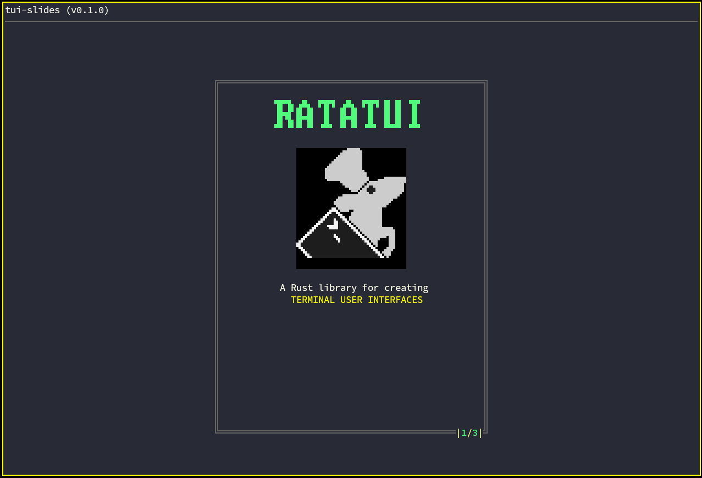

# tui-slides
Terminal Presentation tool with modern TUI capable to render images in terminal and with many more widgets.



## Install via cargo
```
cargo install tui-slides
```

## Usage
To create new presentation You have to create a folder with JSON file where you can create Your presentation slides.
Example file is here.

## Run
To start `tui-slides` we just call it with argument `-j` where we specify path to JSON file with slides data.
```
tui-slides -j="./path_to_slides/slides.json"
```

### JSON: root
Main section of slide config is `box_size`. Here we set fixed size of content box.
```
"box_size": { "width": 50, "height": 50 }
```

### JSON: slides
`slides` property is defining content. Slide content have it's `type`, `content`, `rect` & `color`.
There are few types at the moment but in the future there should be support for every widget in Ratatui library.
Supported widgets ATM:
- Image
- Block
- Paragraph
- Line
- Bigtext

